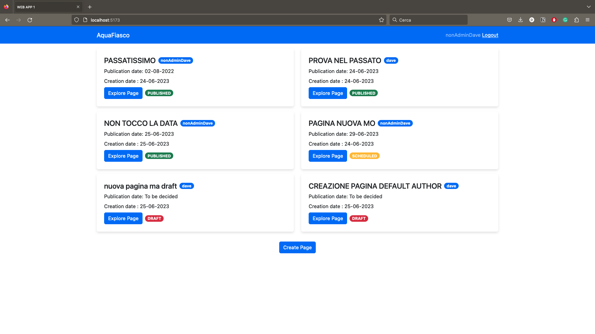
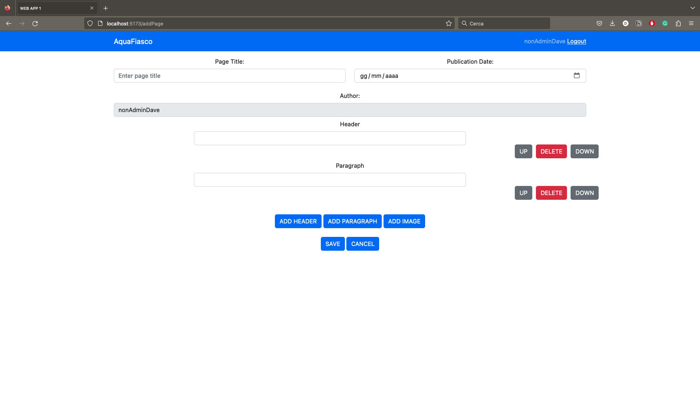

# Exam #12345: "CMS Small"

## Student: s309305 CARIA DAVIDE 

# Server side

## API Server

### PUBLIC APIs - do not require authentication

- POST '/api/login'
  - body with username and password in JSON format
  - user logged

- POST '/api/logout'
  - no information in the body
  - acknowledgement

- GET '/api/publishedPages'
  - no information in the body
  - list of publicate pages

- GET '/api/publishedPages/:pageId/blocks'
  - the page id of the requested blocks as a parameter, no information in the body
  - list of all blocks having the pageId of the published page

- GET '/api/title/getTitle'
  - no information in the body
  - title of the CMS

### PRIVATE APIs - they all require credentials:'include' in the body

- POST '/api/getAllUsers'
  - no information in the body
  - list of all the users present

- POST '/api/page/:pageId/modify'
  - attributes of the page to be modified in the body, pageid in the parameters
  - acknowledgement

- POST '/api/page/add'
  - attributes of the page to be created in the body
  - pageId of the created page

- POST '/api/blocks/update'
  - list of blocks to be update
  - acknowledgement

- POST '/api/blocks/add'
  - list of bloks to be added
  - acknowledgement

- POST '/api/blocks/delete'
  - list of bloks to be deleted
  - acknowledgement

- POST '/api/page/delete'
  - the id of the page to be deleted in the body
  - acknowledgement

- GET '/api/allPages'
  - no information in the body
  - the list of all pages in the db

- GET '/api/allPage/:pageId/blocks'
  - the page id of the block to be retrived
  - list of blocks having the given page id

- POST '/api/title/update'
  - new name of the CMS in the body
  - acknowledgement

## Database Tables

- Table `pages` - contains pageId, title, author, userId, creationDate, publicationDate
  - constraints on userId
  - this table stores the pages created by users
- Table `blocks` - contains blockId, pageId, position, type, content
  - constraints on pageId
  - this table stores all the blocks of the pages created by users
- Table `title` - contains titleId, title
  - this table stores the title of the website and could possibily serve some history function
- Table `users` - contains userId, type, useranme, password, name, surname, salt
  - this table stores all the users created in the website

# Client side

## React Client Application Routes

- Route `index`: the page displays the pages availabe, it receives the list of pages
- Route `/login`: the page allows the login of a user 
- Route `/blocks/:pageId`: the page contains the visualization of all blocks in the selected page, the parameter is the page id of the desired page
- Route `/editPage/:pageId`: the page allows to edit the specific page, the parameter is the page id of the desired page to be modified
- Route `/addPage`: the page allow the creation of a new page from scratch 

## Main React Components

- `MainLayout` (in `App.jsx`): this component is created to render the main layout of the page, including navbar and persistent buttons
- `PageList` (in `PageList.jsx`): this components displays the list of pages available to the current user (not logged or logged)
- `LoginForm` (in `LoginForm.jsx`): this component displays the login form
- `ExplorePage` (in `ExplorePage.jsx`):  this component shows the strucure of a page handing the rendering schema of the other components below
- `PageDetails` (in `ExplorePage.jsx`): this component shows the author and title of the page and handle possible delays from db
- `BlockDetails` (in `ExplorePage.jsx`): this component displays the blocks of the given page, one block per element
- `EditOrAddPage` (in `EditOrAddPage.jsx`): this component allows to modify an existing page or adding a new one, it manages the two different cases with the passed props and leverages the fact that most of the code is shared among a modify operation and a create operation

# Usage info

## Example Screenshot

### List of all the pages

### Creation of a new page

## Users Credentials

- dave , password (admin user)
- nonAdminDave , password
- lunaRossa , bestTeam (admin user)
- teamNewZeland , dominator
- americanMagic , oldButGold
- ineosBritannia , unlucky
